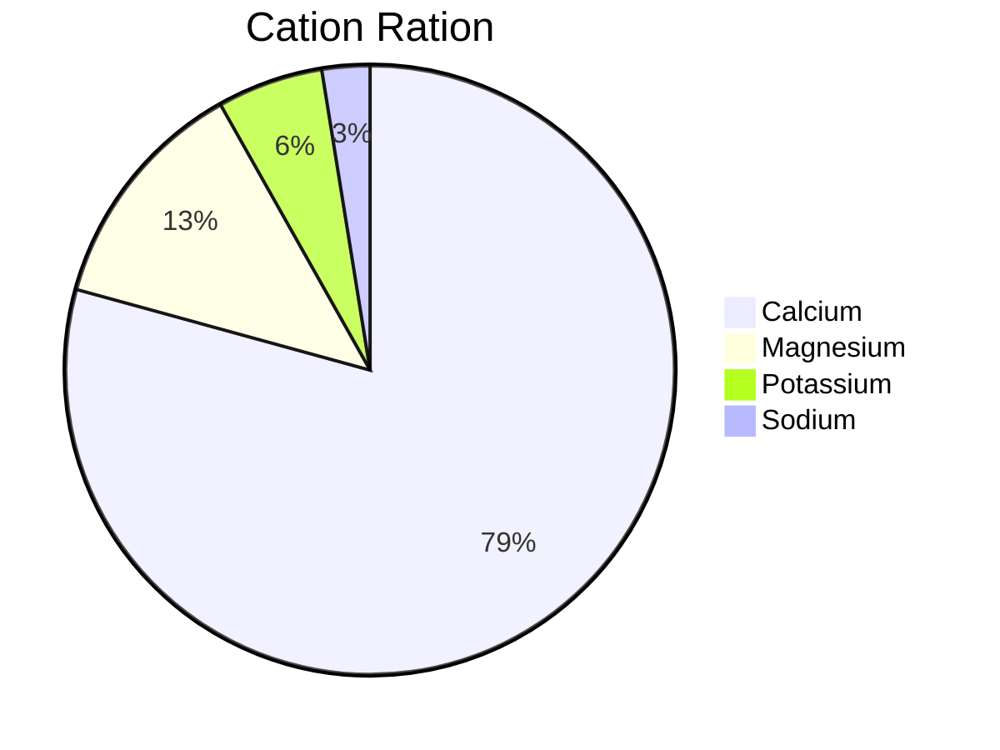

#soil_test  #cation_ratio #M3 #Mehlic-3 #saturated_paste #SP 
# Discussion of Soil Tests

Received soil results 05-01-2024.  Brandon review 05-22-2024.

Previous test = 2023-12.
## M3
### pH 

- From M3 and Saturated Paste (SP): The pH is 6.7.   
This is very near to the "sweet spot" which is between 6.8 and 7.
### Soluble Salts
- From SP: 2,145 ppm. 
	- previous 425.
- Brandon's target for soluble salts is around 1,000 to 1,200.
- This number is reflective of calcium, magnesium, potassium, and chlorides. 
### Cation ratio
As Brandan has said, the Saturated Paste report has the actionable data, but the M3 is where Brandon looks for 60% to 70% calcium, 12% to 15% magnesium.  Brandon will typically recommend low levels of magnesium amendment because magnesium deficits are easy to detect.   And it's so easy to fix. Just two tablespoons of Epsom salt as a drench. Boom, the magnesium deficit is gone.  Magnesium is the bully cation. It will out-compete calcium and potassium.  In theory, calcium should dislodge everything. In practice, magnesium is the one that causes all the problems.   Magnesium runs the cations. It will out-compete potassium. Potassium is much more important in Cannabis than it is for nutrient-dense food. Too much Magnesium will prevent potassium from getting into the plant. 

| Calcium | Magnesium | Potassium | Sodium |
| ------- | --------- | --------- | ------ |
| 79.34%  | 6.52%     | 3.82%     | 1.11%  |
|         |           |           |        |

Brandon noted a little tip. If the Magnesium is above 10% on the M3 report, ignore it on the paste report. This round, the Magnesium is still lower than 10% at 6.52%.
## Phosphate
- 2,868 lbs/acre   - secret
- Brandon's target is 1,500.  
## Calcium
- 10,278 lbs/acre (WOW!)
- Target value for Calcium lbs/acre is 4,000.  - secret
## Magnesium
- 507 lbs/acre
- Target value for Magnesium is 350 lbs/acre. reading 
## Potassium
- 966 lbs/acre
- Target value for Potassium is 600 lbs/acre.  
## Sodium
- 166 lbs/acre. (high but don't flush yet?)
- Target is under 200 lbs/acre.  
## Other section of M3

- Ammonium = 0.3 ppm
- Nitrate = 283.2 ppm

And then the last section of the Mehlic 3 - "Other", have numbers for Ammonium and nitrate.  Ammonium and nitrate are your two forms of nitrogen in your soil. Some plants prefer one or the other. Cannabis does great with nitrates. When Brandon looks at the Ammonium number, if it is 0.9 or lower, he is great with it.  Experientially, we know that under 1, we're not having ammonium cycling into nitrate. This means the temperature in the soil is going to be stable. The roots are not going to get burnt.  Brandon just saw somebody that had all their ammonium numbers  above 11, like 11, 16.  They are going to get a ton of nitrate from that!  

## Saturated Paste

### Chloride
- 217 ppm
200-300 is in the very high range.  
### Bicarbonate
-  49 ppm
 (Brandon's note from last round)...If the Bicarbonates number is anything under 120, I wouldn't even worry about.
### Sulfur
- 166.7 ppm
Target reading is 68. 

### Phosphorus
- 0.51 ppm
Target is 2.4.  All growers tend to be low in available phosphorus.  

M3 showed the available reserve locked up in Phosphate as 2868 lbs/acre, which is already high.  I could use something along the lines of a Mammoth P product once a week?
